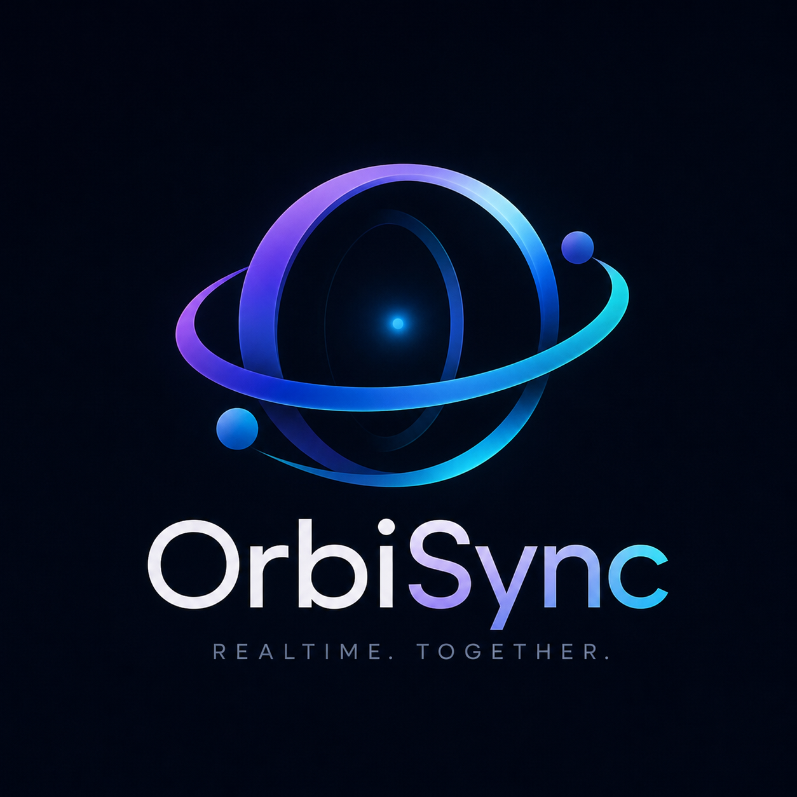

# OrbiSync

**日本語** | [English](README.en.md)

<p align="center">
  
</p>

OrbiSyncは、複数の認証済みクライアントでワールド、エンティティ、位置・向き・状態、イベントを共有するRust製のリアルタイム同期エンジンです。PostgreSQL、REST API、Protocol BuffersによるWebSocket通信、TypeScript SDKを提供します。描画、アセット、物理エンジン、アプリ固有のルールはクライアントや外部サービスに実装します。

このREADMEはOSSリポジトリの現在のソースと設定を説明します。開発中であり、本番運用の準備完了や性能・接続数を保証するリリースではありません。配布バイナリのビルド・起動確認と未実施項目は各リリースノートに記載します。過去の検証結果を、この公開版の全テスト・実サービス接続・負荷試験の再実行結果として扱いません。

## ビルド済みサーバー

[GitHub Releases](https://github.com/machitorimh-cmd/orbisync-engine/releases/tag/v0.1.0-preview.1)にWindows x64用ZIPとLinux x86_64用tar.gzを用意しています。Rust・Node.jsは不要で、PostgreSQLは別途必要です。日英の起動ガイド、ランチャー、ライセンス、依存ライセンスを同梱しています。チェックサムは `SHA256SUMS.txt` です。[利用手順](deploy/distribution/README.ja.md)

## 開発状況

次はソースに実装されている機能です。すべての環境で動作確認済みという意味ではありません。

| 領域 | 現在の実装 |
|---|---|
| 認証・管理 | ログイン、トークン、ユーザー・ロール、パスワード変更・復旧、監査ログ、管理診断 |
| World / Instance | 作成・参照・管理、参加・退出、参加者管理、起動・停止 |
| リアルタイム同期 | 認証付きWebSocket、snapshot / delta、Entity生成・更新・削除・所有権移転、revision検証 |
| 接続・配信 | Resumeと再同期、Interest Management、可視性・所有権に基づく配信、送信キューとbackpressure |
| 永続化・運用 | PostgreSQL、migration、checkpoint / restore、health、metrics、運用CLI |
| クライアント | TypeScript SDK、初期同期待機、サーバー権威の入力API、表示用の予測・補間ヘルパー |
| 外部連携 | Extension API、webhook、運用者が設定する外部HTTPS入力ルール |
| 管理画面 | Rustバイナリに埋め込んだWebセットアップ・管理UI。日本語 / 英語の切替 |

REST契約は[OpenAPI](openapi/orbisync-v1.yaml)の37 paths / 46 operations、リアルタイム契約は[realtime.proto](proto/orbisync/v1/realtime.proto)です。WebSocketは `/ws` と `/v1/realtime/ws` で提供します。契約と実Routerの対応は `scripts/validate_openapi_routes.py` で検査できます。

SDKの変更対象に限定した状態適用・個別Entity revision取得、Presenceのmembershipキャッシュ、配信先の索引、Instance間の上限付きtick処理とcheckpoint処理を含みます。参照3Dデモは初期同期完了を待って送信し、静止中のrevision更新も応答として扱います。これらの実装から速度向上率や最大接続数を推定して保証するものではありません。

Coreはレンダリング、音声・映像配信、物理エンジン、決済、ワールドエディタを提供しません。設計・受入項目の対応は[ロードマップ](docs/design/roadmap-and-traceability.md)と[テスト対応表](docs/design/acceptance-traceability/)を参照してください。

## 入手

```sh
git clone https://github.com/machitorimh-cmd/orbisync-engine.git
cd orbisync-engine
```

このリポジトリは、開発用リポジトリからソースを取り出した独立したGit履歴です。内部作業メモ、検証ログ、依存キャッシュ、生成コード、ローカル認証設定は含みません。旧開発履歴のコミットを必要とする検査は、その履歴やfixtureを別途用意する必要があります。

## ローカル開発

### 必要なもの

| ツール | 用途 |
|---|---|
| Rust / rustup | `rust-toolchain.toml` がRust 1.95.0を指定。ソースからサーバーをビルドする場合に必要 |
| PostgreSQL | サーバー用DB。開発用Composeは17を使用し、16用profileも定義 |
| Docker Compose v2 | ComposeでDBやサーバーを動かす場合のみ |
| Node.js 24.x / npm | SDKとSDK利用アプリの開発。SDKの `engines` 指定に合わせる |
| Python 3.12+ | 設計・依存規則などの検査。OpenAPI検査には別途 `openapi-spec-validator` / `pyyaml` が必要 |

Rustサーバーはbuild script内の `protox` でプロトコルコードを生成するため、`protoc` は不要です。埋め込み管理UIの利用にはNode.jsも不要です。参照3Dデモ単体はNode.js 22以上を指定しています。

### ブラウザで初期設定する

空のPostgreSQLデータベースを用意して、リポジトリのルートで実行します。

```sh
cargo run -p orbisync-server -- web-admin
```

表示されたプライベートURLを同じ端末のブラウザで開き、DB接続、パスワードdenylist、管理者作成、エンジン起動を設定します。UIは日本語と英語に対応します。新規セットアップでは鍵の生成とmigrationも行います。既存DBへの再初期化には使いません。

管理リスナーは `127.0.0.1` に限定され、既定の管理ポートは8090、エンジンは8080です。既定の保存先 `.orbisync-admin/` には認証情報があるため、Gitへ追加しないでください。管理UIの **Production** はdenylistの選択モードであり、製品の本番運用保証を示す表示ではありません。

初期パスワードの保存・変更、再起動、既存環境、headless利用は[Webセットアップガイド](apps/admin-web/README.md)を参照してください。

### Composeで開発環境を起動する

以下はBash用です。WindowsではBash / WSLを使用するか、上のWebセットアップを利用してください。

```sh
cp deploy/compose/.env.example .env
bash scripts/gen-dev-password-denylist.sh
docker compose -f deploy/compose/compose.dev.yml --env-file .env up -d postgres
docker compose -f deploy/compose/compose.dev.yml --env-file .env run --rm --build --entrypoint orbisync-server server migrate
docker compose -f deploy/compose/compose.dev.yml --env-file .env up -d --build server
```

`.env.example` と生成denylistは開発用です。サーバーのdenylistには10,000件のcorpusが必要です。開発ジェネレーターのプレースホルダーは実際の一般的なパスワードを防ぎません。実ユーザーが利用する環境では、運用者が選定した本物のcorpusと独立した秘密鍵を用意してください。ComposeはTLS、バックアップ、監視を自動構成しません。

ホスト上でRustサーバーを動かす場合は、Composeの `postgres` だけを起動し、DB接続先と鍵を環境変数へ設定します。`DATABASE_URL` はホストから到達できる値にしてください。

```sh
set -a && . ./.env && set +a
export ORBISYNC_PASSWORD_DENYLIST_FILE=deploy/dev-password-denylist.txt
cargo run -p orbisync-server -- migrate
cargo run -p orbisync-server -- doctor
cargo run -p orbisync-server
```

設定の優先順位はCLI > 環境変数 > 設定ファイル > 既定値です。[設定例](orbisync.toml.example)と[開発用Compose設定](deploy/compose/compose.dev.yml)を参照してください。`doctor` は設定・DB・migrationなどの非破壊診断で、migrationを実行するコマンドではありません。

CLIで最初の管理者を作成する場合は、migration済みでユーザーがまだ存在しないDBに対して実行します。出力先はリポジトリ外の安全な場所にしてください。

```sh
cargo run -p orbisync-server -- bootstrap-admin --login-id admin --display-name Administrator --password-denylist deploy/dev-password-denylist.txt --password-output ../orbisync-initial-admin-password.txt
```

起動確認用のendpointは `/health/live`、`/health/ready`、`/version` です。その他の操作と必要な権限は[OpenAPI](openapi/orbisync-v1.yaml)を参照してください。

## TypeScript SDKを生成・ビルドする

SDKの生成コードと `dist/` はGit管理外です。Node.js 24.xで、clone後とproto変更後に次をリポジトリのルートから実行します。

```sh
npm install --global @bufbuild/buf@1.72.0 @bufbuild/protoc-gen-es@2.13.0
cargo install protoc-gen-prost --locked --version 0.5.0
buf generate
npm --prefix sdk/typescript ci
npm --prefix sdk/typescript run build
```

両pluginをPATHへ通してください。ルートの `buf.gen.yaml` はTypeScriptを `sdk/typescript/src/generated/`、Rustを `generated/rust/` に出力します。Rustサーバー自身のビルドは別途 `OUT_DIR` へ生成します。

SDKのパッケージ入口は `dist/index.js` です。`npm ci` や `buf generate` だけでは利用アプリに必要なSDKビルドは完了しません。配布用tarballと利用例は[SDK開発手順](sdk/typescript/DEVELOPMENT.md)と[配布手順](docs/consumer-kit/PRODUCING.md)を参照してください。

## サンプルと管理画面

### REST / realtime参照コンソール

**上記のSDK生成・ビルドを済ませてから**実行します。稼働中のサーバー、ユーザー、操作に必要な権限が必要です。

```sh
npm --prefix apps/reference-console-web ci
npm --prefix apps/reference-console-web run dev
```

既定URLは `http://localhost:5173`。ログイン、World / Instance、Entity操作、Resumeの操作例があります。[詳細](apps/reference-console-web/README.md)

### 独立した管理コンソール

埋め込みセットアップUIとは別の、既存REST APIを操作するViteアプリです。

```sh
npm --prefix apps/admin-console-web ci
npm --prefix apps/admin-console-web run dev
```

既定URLは `http://localhost:5174`。[詳細](apps/admin-console-web/README.md)

ホスト起動のAPIには、使用する画面のoriginを起動前に許可してください。Compose開発設定には次のoriginが設定されています。

```sh
export ORBISYNC_CORS_ALLOWED_ORIGINS=http://localhost:5173,http://127.0.0.1:5173,http://localhost:5174,http://127.0.0.1:5174
```

### 3Dデモ「星あかりの島」

```sh
npm --prefix apps/reference-web ci
npm --prefix apps/reference-web run dev
```

このアプリはdev / build / check前に自身の依存関係でTypeScriptプロトコルを自動生成します。上記のグローバルpluginやSDKパッケージの事前ビルドは不要です。Node.js 22以上で動作する設定です。

一人用はサーバー不要。オンラインではアカウントと参加可能なInstanceが必要で、位置と向きを共有します。アイテム収集・スコア・クリア判定は各クライアントのローカル状態です。[起動・操作](apps/reference-web/RUNNING.md)

コンソールとデモはともに5173を使用するため、同時起動時は別ポートを指定し、対応するCORSも設定してください。

## 検証と制約

CIは `main` へのpushと `main` 向けPRで自動実行します。[実行結果](https://github.com/machitorimh-cmd/orbisync-engine/actions/workflows/ci.yml)を確認できます。SDKのCIはNode.js 24を使用します。

目的に応じた検査コマンドの例です。今回実行したという記録ではありません。

```sh
python scripts/validate_design.py --review
python scripts/check_architecture.py
# SDKの依存導入・proto生成後
npm --prefix sdk/typescript run check
```

SDKテストの一部はRustの `orbisync-e2e-helper` を事前ビルドする必要があります。DBを使う検証やブラウザ検証にもそれぞれ準備が必要です。[SDK開発手順](sdk/typescript/DEVELOPMENT.md)と[テスト設計](docs/design/test-and-ci.md)で対象と前提を確認してください。`scripts/bootstrap-dev.sh` はDB準備に加えてworkspace全体の検査も実行するため、軽量な起動だけのコマンドではありません。

このソース配布には公開container imageを同梱していません。24時間連続稼働や1,000接続を保証する評価はありません。運用時のTLS、鍵管理、denylist、バックアップ、復旧、性能評価は利用構成に合わせて整備してください。

## 主要ドキュメント

- [フロントエンド連携](docs/guides/frontend-integration.md) / [SDK利用ガイド](docs/consumer-kit/README.md)
- [Webセットアップ・管理](apps/admin-web/README.md) / [パスワード復旧](docs/operations/admin-password-recovery.md)
- [アーキテクチャ](docs/design/architecture.md) / [crate構成と依存規則](docs/design/repo-crate-conventions.md)
- [設計索引](docs/design/README.md) / [ADR](docs/adr/README.md) / [原仕様](metaverse_core_specification.md)
- [運用Runbook](docs/operations/README.md) / [脅威モデル](docs/security/threat-model.md)
- [拡張API](docs/guides/extension-command-api.md) / [外部入力ルール](docs/consumer-kit/EXTERNAL-RULES.md)

詳細文書には日本語のみのページや過去の設計・検証記録も含まれます。英語版READMEは [README.en.md](README.en.md) です。

## Contributing

[CONTRIBUTING.md](CONTRIBUTING.md)を参照してください。通常の不具合・提案はIssueへ、脆弱性や秘密情報は公開せず[SECURITY.md](SECURITY.md)の手順へ進んでください。

## License

利用者の選択により [MIT](LICENSE-MIT) または [Apache-2.0](LICENSE-APACHE)。SPDX: `MIT OR Apache-2.0`。

Copyright © 2026 avistoria
