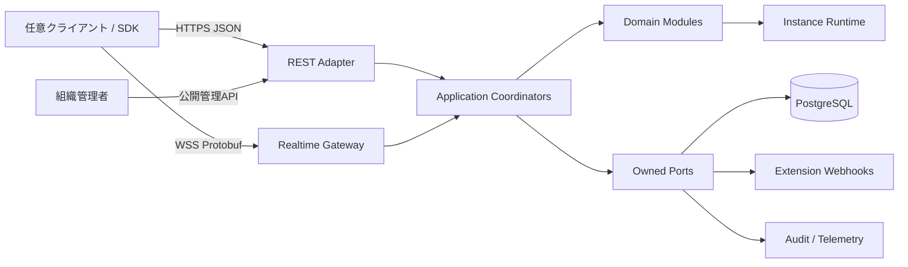
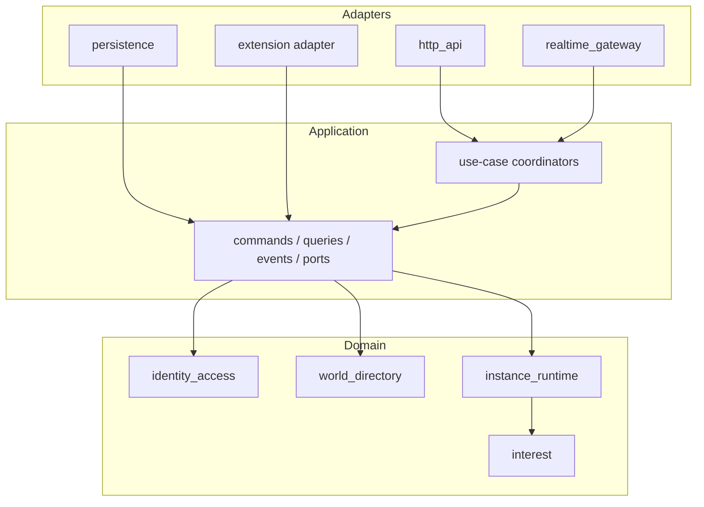
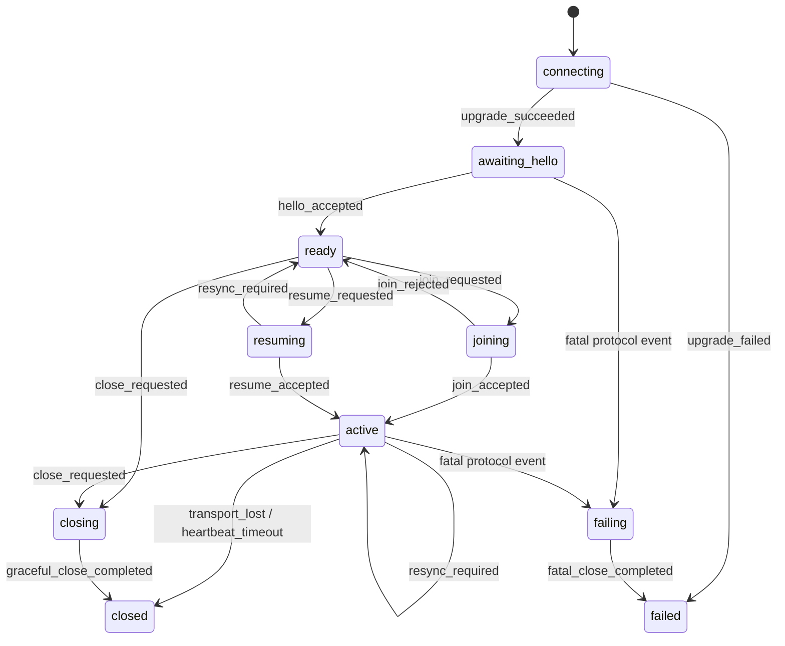
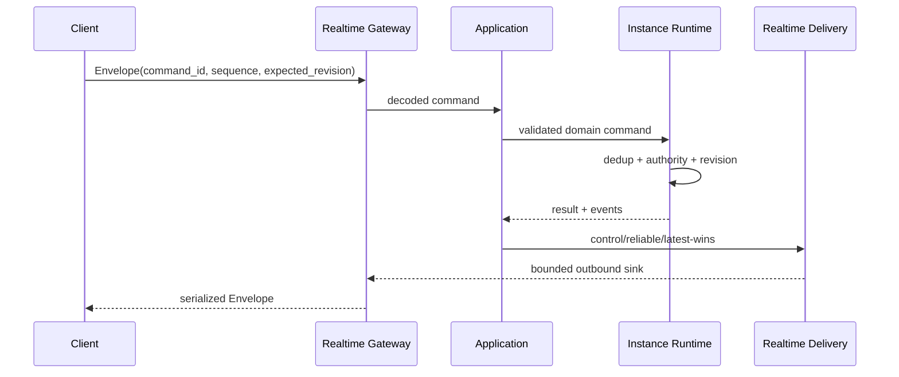

# OrbiSync 設計図

図は理解補助であり、契約の正本は各設計文書、ADR、OpenAPI、Protoである。

## システムコンテキスト

## モジュラーモノリスの依存方向

## Realtime接続状態機械

次図は主要経路だけを示す非規範の要約図であり、全event/transitionを列挙しない。完全な機械契約は`contracts/realtime-connection-state-machine.json`、人間可読な完全表は`realtime-protocol-and-connection.md` §5.1を正本とし、両者をCIで対照する。

## 状態更新と配送

