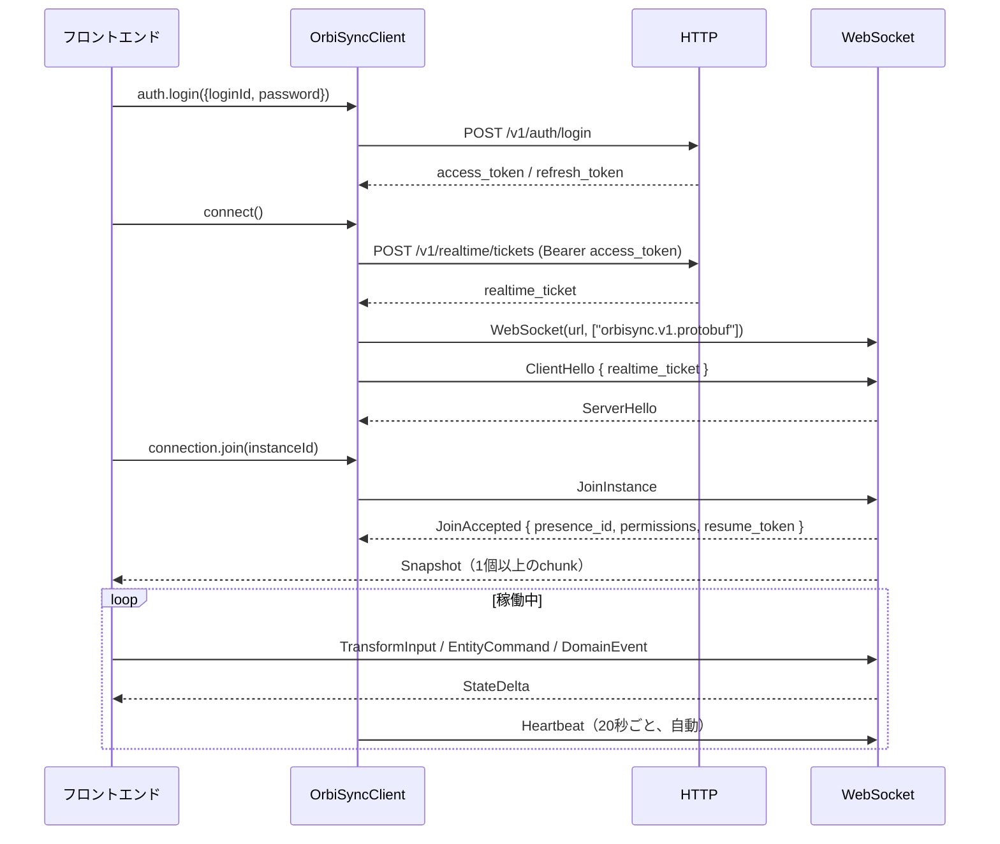

# OrbiSync フロントエンド接続ガイド

OrbiSyncサーバーに対してブラウザやゲームクライアントを接続するための手順書です。ログインから入室、状態の受信と送信、切断復帰までを、実装済みのコードだけを根拠に順に説明します。

## 0. この文書の位置づけ

**本書は実装の記述であり、契約の定義ではありません。**

| 種類 | 正本 | 役割 |
|---|---|---|
| REST契約 | [`openapi/orbisync-v1.yaml`](../../openapi/orbisync-v1.yaml) | endpoint・要求・応答の定義。`scripts/validate_openapi_routes.py` が実Routerとの一致を検証します |
| Realtime契約 | [`proto/orbisync/v1/realtime.proto`](../../proto/orbisync/v1/realtime.proto) | WebSocketフレームの定義（ADR-004） |
| エラー契約 | [`openapi/errors.yaml`](../../openapi/errors.yaml) | codeとHTTP statusとretryableの対応 |
| SDKの実装 | [`sdk/typescript/src/client.ts`](../../sdk/typescript/src/client.ts) | **本書が記述している対象** |
| SDKの設計意図 | [`docs/design/client-sdk.md`](../design/client-sdk.md) | 設計判断の根拠 |

設計文書側のAPI例（`client-sdk.md` §10）は `[REC]` であり、「命名、構造、オプションは ADR-011 と実装で確定する。シグネチャの確定ではない」と明記されています。したがって**実際に呼ぶAPIの正は `client.ts`** です。本書は署名を引用するたびに行番号を併記するので、乖離したら実装側を読み直してください。

endpointの本数などの数値は本書に転記しません。正本を参照してください。

## 1. 前提

### 1.1 サーバーを起動する

手順は [README](../../README.md) の「最短起動」を参照してください。`docker compose` 一式か、PostgreSQLだけ起動して `cargo run -p orbisync-server` のどちらでも構いません。

起動後、`curl http://localhost:8080/health/ready` が200を返せば接続可能です。503の場合はDB接続が確立していません。

管理者ユーザーは `bootstrap-admin` で作ります。これもREADMEに手順があります。**ユーザーが1人もいない状態ではログインできる相手がいない**ので、フロントエンドを書く前に必ず作ってください。

### 1.2 生成コードを作る（最初にやること）

`generated/` は `.gitignore` されています。`.proto` が唯一の正であり、生成コードはcommitしません（ADR-004）。**cloneした直後は生成コードが存在しないので、SDKのimportが全て失敗します。**

```shell
npm i -g @bufbuild/buf @bufbuild/protoc-gen-es
buf generate     # リポジトリルートで実行
```

出力先は [`buf.gen.yaml`](../../buf.gen.yaml) が定めており、2箇所に分かれます。

| プラグイン | 出力先 |
|---|---|
| `protoc-gen-es` | `sdk/typescript/src/generated/orbisync/v1/realtime_pb.ts` |
| `protoc-gen-prost` | `generated/rust/` |

TypeScript側はSDKの内部に生成されます。`client.ts` は `./generated/orbisync/v1/realtime_pb.js` として相対参照しているので、無いまま `tsc` を走らせると `Cannot find module './generated/orbisync/v1/realtime_pb.js'` で落ちます。

生成済みかどうかは次で確認できます。

```shell
ls sdk/typescript/src/generated/orbisync/v1/realtime_pb.ts
```

### 1.3 SDKはnpmに公開されていません

`sdk/typescript/package.json` は `"private": true` です。registryからは取得できないので、リポジトリ内から参照してください。

```ts
import { OrbiSyncClient } from "../../sdk/typescript/src/client.js";
```

## 2. 全体フロー



**認証情報は2種類あり、互いに流用できません。** access tokenはREST用、realtime ticketはWebSocket用で、audienceで分離されています。`/ws` にaccess tokenを出しても、REST endpointにrealtime ticketを出しても拒否されます。

## 3. 接続手順

### 3.1 クライアントを作る

```ts
import { OrbiSyncClient } from "../../sdk/typescript/src/client.js";

const client = new OrbiSyncClient({
  baseUrl: "http://localhost:8080",
});
```

`ClientOptions`（`client.ts:363`）で指定できる項目です。

| キー | 既定値 | 意味 |
|---|---|---|
| `baseUrl` | 必須 | HTTPのオリジン。WebSocket URLは `http` から `ws` への置換で導出されます |
| `wsPath` | `/ws` | サーバーは `/ws` と `/v1/realtime/ws` の両方で同じhandlerを提供します |
| `subprotocol` | `orbisync.v1.protobuf` | デバッグ用に `orbisync.v1.json` があります |
| `clientName` | `@orbisync/client` | `ClientHello` に載り、サーバーログに出ます |
| `clientVersion` | `0.1.0` | 同上 |
| `clientType` | `desktop` | `desktop` / `mobile` / `server` |

### 3.2 ログイン

```ts
await client.auth.login({ loginId: "admin", password: "..." });
```

`client.ts:1598`。内部で `POST /v1/auth/login` を呼び、`access_token` / `refresh_token` / `expires_in` をSDK内部に保持します。**tokenを取り出すpublic APIはありません**。`expires_in` が返らない場合は15分と仮定します。

更新は自動です。`connect()` の内部で `ensureValidAccessToken()`（`client.ts:1537`）が走り、有効期限の80%を超えていればrefreshします。ticket取得が401を返した場合も1回だけrefreshして再試行します（`client.ts:1571`）。

明示的に更新したい場合は `await client.refreshAccessToken()` を呼びます（`client.ts:1557`）。

### 3.3 接続する

```ts
const connection = await client.connect();
```

`client.ts:1623`。この1行が以下を行います。

1. access tokenの有効性確認と必要なrefresh
2. `POST /v1/realtime/tickets` でrealtime ticketを取得
3. `new WebSocket(wsUrl, ["orbisync.v1.protobuf"])` で接続し、`binaryType` に `arraybuffer` を設定
4. **ticketを `ClientHello.realtime_ticket` に入れて最初のprotobufフレームとして送信**
5. `ServerHello` を待つ（5秒でtimeout）

**ここが最も誤解されやすい点です。realtime ticketはquery parameterでもAuthorizationヘッダでもなく、最初のprotobufフレームの中身として送ります。** 自前でWebSocketを実装する場合は必ずこの形にしてください（`client.ts:310` の `openCandidateSocket`）。

`connect()` は同時呼び出しに対して同じPromiseを返します。二重接続にはなりません。

自動リトライ付きの `connectWithRetry(maxAttempts = 5)` もあります（`client.ts:1664`。base 1秒、上限30秒、full jitter）。

### 3.4 入室と初期状態の待機

改善④のstrict同期は、ServerHelloで `orbisync.state-sync.v1` が合意された接続で利用します。

```ts
const instance = await connection.join("0192d43d-a18a-7fed-8123-0123456789ab");
```

`client.ts:1432`。`JoinInstance` を送り、`JoinAccepted` を待って `OrbiSyncInstance` を返します。

> [!IMPORTANT]
> **`join()` はSnapshotを待ちません。** `JoinAccepted` を受け取った時点でresolveし、状態は後から `snapshot` イベントで届きます。`await join()` の直後に描画しても、まだ何もありません。

handlerの登録は `await join()` の**直後に同期的に**行ってください。間に別の非同期処理を挟むと、取りこぼす可能性があります。

```ts
const connection = await client.connect();
const instance = await connection.join(instanceId);
const redraw = () => render(instance.state.entities);
instance.on("snapshot", redraw);
instance.on("entityUpdated", redraw);
instance.on("entitySpawned", redraw);
instance.on("entityDeleted", redraw);
await instance.ready();
redraw();
```

`join()`はJoinAcceptedで返ります。Snapshotが即時到着してイベント購読より先に適用されても、SDKは送信前に受信ルータを登録しているため状態を保持します。`ready()`の後に必ず`state`を読み取ることで初期描画を行えます。raw WS購読やアプリ独自のchunk組立ては不要です。

初期同期・再同期中の変更送信は`SyncError("NOT_READY")`となります。`syncStateChanged`を購読し、`instance.syncStatus === "ready"`の間だけ編集を有効にしてください。接続ごとに1 instanceを扱い、切替時はleaveして新しい接続を作成します。

### 3.5 readyの寿命と復帰

- `ready({timeoutMs, signal})`は複数同時呼出が可能です。既readyなら即時解決し、個別abortは他の待機・接続を取り消しません。既定timeoutは10秒です。
- 切断・leaveは既存待機をrejectします。再接続中に新しく呼んだreadyは、次の世代の完全な状態を待ちます。closed/failedへの呼出は即時rejectします。
- 現CoreのResume成功はResumeAcceptedに続くSnapshotで復帰します。ResyncRequiredはjoin待ちに戻るため、その接続でfresh joinします。Active状態の同期破損は新ticket/socketでjoinし直します。
- strict同期の自動再試行は最大5回です。認証失効・未対応server・明示leaveは終了します。
- 旧serverでは通知がないinstanceでもreadyが`UNSUPPORTED_SERVER`になります。旧rawイベント利用はstrict state/ready保証の対象外です。

## 4. 状態とイベント

`instance.state`は内部状態から切り離されたコピーです。`entities`と`presences`はMap、revisionはbigintです。コピーの変更はSDKへ反映されません。Snapshot内の大整数はJSONの整数tokenから直接読み、精度を落としてからbigintへ変換しません。

| イベント | strict同期のpayloadとタイミング |
|---|---|
| `snapshot` | 検証・原子的な状態適用後の全体Snapshot。dataは結合済み、chunkCountは1 |
| `entityUpdated` / `entitySpawned` | 確定状態のSyncedEntity。handler内のstateは適用済み |
| `entityDeleted` | `{ entityId }`。適用後の削除通知 |
| `entityCommand` | Coreの確定command。commandIdで送信と対応付ける。重複応答も通知されるが状態は重複適用しない |
| `syncStateChanged` | syncing / ready / reconnecting / recovering / failed / closed |
| `error` | CoreのErrorMessageまたはSDKのSyncError。handlerの同期例外もHANDLER_FAILEDとして隔離 |
| `domainEvent` | 通知のみ。canonical状態は変更しない |

### 4.1 revisionとcomponent

Snapshotのrevisionはinstance境界です。StateDelta.toRevisionと確定EntityCommand.instanceRevisionもinstance境界ですが、EntityState.revisionとspawn/update確定のexpectedRevisionはentity revisionです。delete確定のexpectedRevisionは従来どおりinstance revisionです。これらを単一の大小比較で処理しません。

SDKはcomponentごとのinstance境界で逆順更新を統合し、delete/spawn境界で古い生存期間の値を除外します。同ID再spawnはentity revision 1に戻ります。送信expectedRevisionの省略時は確定済みentity revisionが使われ、SDKは予想値を加算しません。numberを明示する場合はsafe integerのみ受け付けます。

custom componentは`properties[key] = { encoding: "json" | "base64", value }`で保持します。updateは指定component全体を置き換えます。spawnの任意argumentsはechoされてもcustomとして保存されないため、必要なアプリはspawn確定後にcustom updateを送り、その確定まで保存完了と扱わないでください。

### 4.2 資源上限

Snapshotは合計16MiB・1024 chunks・2 IDs・10秒、保留通知は2048件/4MiB、ready待機とevent listenerは各1024、tombstoneは4096が既定上限です。Snapshotでtombstoneを回収し、その境界以下の遅延通知はfloorで除外します。上限超過・欠損・矛盾はtyped errorと有限のfresh join回復になります。再同期中も以前の確定stateは読めますが編集はできません。

保持stateはUTF-16文字列・container項目を含む保守的集計で32MiB（`sync.maxStateBytes`）、送信queueはreliable/latestの合計4MiB、単一受信frame/送信messageは64KiBです。重複照合用の最新Snapshot bytesとbaseline、原子的適用中のstaged stateは別の有界コピーとして保持します。白板の確定待ちは32件かつ1MiB、作成再送待ちは16件です。明示closeではstate・listenerも回収します。

uint64 revisionはbigint、number入力はsafe integerだけを受理します。customのStruct引数へunsafe整数やbigintを直接入れず、必要なら文字列で表してください。既存Core custom bytesにunsafe JSON数値が含まれる場合は、元bytesをbase64 envelopeで返します。旧保存dedup応答のinstance_revision欠落は`UNSUPPORTED_SERVER`として終了し、再実行や現在revisionによる補完はしません。

## 5. 送信

**送信の3系統は失敗の仕方が違います。ここを取り違えるとアプリが落ちます。**

| メソッド | 配信クラス | 輻輳時の挙動 | 失敗の通知 |
|---|---|---|---|
| `sendTransform` | latest-wins | 同じキーの古いフレームを**黙って捨てる** | 入力不正は同期例外。輻輳による破棄数は `getQueueMetrics()` で観測 |
| `sendEntityCommand` / `transferEntityOwnership` | reliable | キューに積む。捨てない | 満杯で**同期的にthrow** |
| `sendDomainEvent` | reliable | 同上 | 同上 |

順序番号と送信時刻は、キューへ登録した時点ではなく、実際の送信時に設定します。集約・容量制限による破棄やHeartbeatの優先送信で、wire上の順序番号が飛ぶことはありません。再接続中の更新はキューに保持し、resumeまたは再入室の完了後に新しい接続の番号で送信します。

### 5.1 sendTransform

```ts
instance.sendTransform({
  entityId: "...",
  position: { x: 1, y: 0, z: 3 },
  rotation: { x: 0, y: 0, z: 0, w: 1 },   // 省略時は単位quaternion
  expectedRevision: 3,                     // 省略時はSDKの追跡値
  component: "transform",                  // 省略時は "transform"
});
```

`client.ts:586`。輻輳していなければ即送信します。輻輳時は entityId と component を組み合わせたキーの latest-wins キューへ入り、同キーの古いフレームは上書きされます。キーの上限は `LATEST_WINS_MAX_KEYS = 1024` で、超えると最も古いキーを捨てます。

**毎フレーム呼んで構いません。**捨てられるのは古い位置情報だけで、最新の1件は必ず残ります。

### 5.2 sendEntityCommand / transferEntityOwnership / sendDomainEvent

```ts
try {
  instance.sendEntityCommand({
    entityId: "...",
    operation: "spawn",
    expectedRevision: 0,
    args: { kind: "avatar" },
  });
} catch (e) {
  if (e instanceof ReliableQueueOverflowError) {
    // 送信が詰まっている。UIを止めるか、ユーザーに知らせる
  }
}
```

所有権移転には型付きhelperを使えます。移譲先は同じInstanceに参加中である必要があり、
serverがowner・権限・revisionを検証します。

```ts
instance.transferEntityOwnership({
  entityId: "...",
  newOwnerId: "...",
  expectedRevision: 3n,
});
```

`client.ts:657` と `client.ts:690`。

部屋内のアプリ用メッセージは次のように送受信します。

```ts
instance.on("domainEvent", (raw) => {
  const event = raw as { eventType: string; data?: Record<string, unknown> };
  if (event.eventType === "custom.chat.message") {
    console.log(event.data?.sender_user_id, event.data?.text);
  }
});
instance.sendDomainEvent({
  eventType: "custom.chat.message",
  data: { text: "こんにちは" },
});
```

許可される名前は `custom.` で始まる128バイト以内の名前です。各ドット区切りの要素には英数字・`_`・`-` が使え、空要素は使えません。サーバーは参加資格を検証し、`sender_user_id` / `sender_presence_id` を認証済みの値で上書きして、同じ部屋の接続者全員（送信者自身を含む）へ配信します。別の部屋には配信しません。不正な名前・参加状態・サイズはエラーになります。

メソッドから戻っただけでは相手への到着を保証しません。自分へのイベント返送はサーバーでの処理確認であり、相手の既読確認ではありません。**有効なresume tokenと保持履歴がある場合、切断中の受信イベントを順に再送し、その後に現在状態のSnapshotを送ります。** SDKはmessage IDで重複受信を抑止します。再送途中で再切断した場合も、適用済みrevisionから再開します。

履歴は部屋のactorがメモリ上に保持し、件数は `realtime.outbound_queue_capacity` 由来、バイト数は16 MiBを上限とします。最新位置の更新やTickだけではイベント履歴を追い出しません。履歴不足やtoken失効は `resyncRequired` を通知して完全再同期へ進みます。サーバー再起動をまたぐチャットの過去ログ保存は提供していません。アプリ側のチャット画面や長期履歴の要件に応じて保存先を用意してください。

認証状態は `client.getAuthState()` と `client.on("authStateChanged", handler)` で確認できます。refresh失敗時は `Unauthenticated` へ遷移し、`client.on("error", handler)` に `RefreshFailedError`（code: `RefreshFailed`）を通知してPromiseを拒否します。自動resumeを停止するので、アプリは再ログイン画面を表示します。

入室の進行は `connection.getConnectionState().sessionState` で確認できます。`Ready` は接続済み・未入室、`Joining` は初期同期中、`Active` はSnapshot適用完了、`Resuming` は復帰中、`Closed` は明示終了です。`phase` は通信接続の状態なので、`connected` だけでは初期同期完了を意味しません。状態の変更は `onConnectionStateChange` でも受け取れます。

`await connection.join(id)` はイベントhandlerを登録できるように、入室が受理された時点でhandleを返します。完成した状態の描画は `snapshotApplied` を使ってください。初期同期中に送信APIを呼んだ場合はキューに保留し、全chunkの適用後に送信します。`expectedRevision` を省略した操作は初回送信時の既知revisionを使います。明示指定したrevisionと、一度送信したコマンドの再送内容は変更しません。最初のSnapshotが届かない場合も10秒でエラー通知して再接続します。

認証通信の失敗時は、通信ライブラリが付けた生の例外やJSON応答断片を公開エラーへ引き継ぎません。password・tokenを `cause` やstackへ残さないためです。通信中断の `AbortError` は名前で識別できます。

> [!CAUTION]
> reliableキューが `RELIABLE_MAX_QUEUE = 256` に達すると `ReliableQueueOverflowError` を**同期的にthrow**します（`client.ts:50`）。`await` していないので `Promise.catch` では捕まりません。ループから呼ぶ場合は `try` と `catch` で囲んでください。囲まないとアプリが停止します。

### 5.3 輻輳状態を見る

```ts
const m = instance.getQueueMetrics();
// { latestWins: { queueLength, droppedUpdates, capacityDrops },
//   reliable:   { queueLength, saturationErrors },
//   control:    { queueLength } }
```

`client.ts:540`。`droppedUpdates` が増え続けている場合、送信頻度が回線に対して高すぎます。

## 6. 権限でUIを出し分ける

`JoinAccepted` は解決済みの権限を持っています。エラーで気付かせるのではなく、最初から出し分けてください。

| フィールド | 意味 |
|---|---|
| `entity_spawn` | entityを新規作成できる |
| `entity_update_own` | 自分が所有するentityを更新できる |
| `entity_update_any` | 他人のentityも更新できる |

```ts
instance.on("joinAccepted", (raw) => {
  const ja = raw as {
    entitySpawn: boolean; entityUpdateOwn: boolean; entityUpdateAny: boolean;
  };
  spawnButton.disabled = !ja.entitySpawn;
});
```

同じ内容はSnapshot JSONの `permissions` にも入っています。

## 7. 切断と復帰

**再接続はSDKが自動で行います。アプリ側の実装は不要です。**

- Heartbeatを20秒ごとに送信。ackが5秒以内に来ない状態が3回続くと切断とみなします（`client.ts:814`）
- 切断を検知すると指数バックオフ（base 1秒、上限30秒、最大20回）で再接続します
- 再接続時は `ResumeSession` にresume tokenを載せます。通れば `resumeAccepted` が届き、差分から再開します
- resumeが通らない場合は `resyncRequired` が届き、SDKが自動で入室し直します
- resume tokenは単回使用で、使うたびにローテーションします

**`OrbiSyncInstance` のハンドルは再接続をまたいで有効です。**SDKが内部のWebSocket参照を差し替えるため（`client.ts:924`）、アプリ側が保持している `instance` を取り直す必要はありません。登録済みのhandlerもそのまま生きます。

明示的に切る場合は次のどちらかです。どちらも自動再接続を止めます。

```ts
await instance.leave();       // graceful。サーバー側でLeave扱い
await connection.disconnect();
```

`resyncRequired` の後は状態が作り直されるので、アプリ側のキャッシュも破棄してください。

## 8. エラーの扱い

REST側は [`openapi/errors.yaml`](../../openapi/errors.yaml) が正本です。`retryable` が真のものだけ再試行してください。

| code | status | 再試行 | フロントエンドでの意味 |
|---|---|---|---|
| `INVALID_REQUEST` | 400 | 不可 | 送信内容の誤り。直さない限り通りません |
| `AUTHENTICATION_REQUIRED` | 401 | 不可 | 再ログインへ誘導 |
| `ACCESS_DENIED` | 403 | 不可 | 権限不足。第6章で事前に隠すべき操作 |
| `RESOURCE_NOT_FOUND` | 404 | 不可 | instance削除済みなど |
| `REVISION_MISMATCH` | 412 | 不可 | 最新のrevisionを取り直して再送 |
| `PAYLOAD_TOO_LARGE` | 413 | 不可 | 分割して送る |
| `RATE_LIMITED` | 429 | **可** | バックオフして再試行 |
| `INTERNAL_ERROR` | 500 | **可** | バックオフして再試行 |
| `SERVICE_UNAVAILABLE` | 503 | **可** | 同上 |

realtime ticket取得が429の場合、SDKは `RealtimeTicketRateLimitedError` を投げます（[`sdk/typescript/src/realtime_ticket.ts`](../../sdk/typescript/src/realtime_ticket.ts)）。`instanceof` で他の失敗と区別できます。

WebSocket側のエラーは `RealtimeError`（`Error` の派生型）として `error` イベントで届きます。`code` / `message` / `requestMessageId` / `retryable` を保持し、`join()` の拒否も同じ型です。`requestMessageId` で、どの送信に対する失敗かを特定できます。

## 9. 落とし穴のまとめ

1. `buf generate` を忘れるとimportが全滅する
2. realtime ticketはヘッダでもqueryでもなく `ClientHello` の中
3. subprotocol `orbisync.v1.protobuf` の指定と `binaryType` の `arraybuffer` 設定は必須
4. access tokenとrealtime ticketは相互に使えない
5. `await join()` の戻り値で `getJoinInfo()` を呼ぶと、resume tokenを含まない参加情報、権限、nearby件数を取得できる。SDKは `JoinAccepted.nearby_entities` のrevisionも内部へseedする
6. handler登録の前に `await` を挟むと初回Snapshotを取りこぼす
7. Snapshotのchunk再結合とrevisionの反映はSDKが行う。完成した状態は `snapshotApplied`、従来の生chunkは `snapshot` で受け取る
8. StateDeltaと成功したEntityCommandのrevisionはSDKが追跡する。特殊な競合制御をしない限り `expectedRevision` は省略できる
9. `sendEntityCommand` と `sendDomainEvent` は同期throwする
10. `sendTransform` は混雑時に同一entityの古い位置を最新値へ集約する。不正な数値・退室済みのhandleは例外になる
11. `entityUpdated` はentityごとに発火する
12. Snapshotの `entities` は視界内に絞られている

## 10. 参照

- 設計の意図: [Client SDK](../design/client-sdk.md)
- プロトコルの詳細: [Realtime Protocol / Connection](../design/realtime-protocol-and-connection.md)
- 再接続・Interest・バックプレッシャー: [Mobile Resume / Interest / Backpressure](../design/mobile-resume-interest-backpressure.md)
- 認証・認可: [Authentication / Authorization](../design/auth-authorization.md)
- REST契約: [REST API / Persistence](../design/rest-api-persistence.md)
- SDKの開発手順: [`sdk/typescript/README.md`](../../sdk/typescript/README.md)
- 期待バイト列: [`test-vectors/`](../../test-vectors/)

`apps/reference-console-web` は実REST/SDK接続の利用者向けsmoke、`apps/admin-console-web` は実REST接続の管理画面です。元の3Dゲームは `apps/reference-web`、初期設定とパスワード復旧用の管理画面は `apps/admin-web` にあります。`examples/minimal-client-typescript` は説明用の最小例なので、実際の接続確認には `apps/reference-console-web` を使用してください。

## 11. 送信直後の切断とエラー処理

`sendDomainEvent()` / `sendEntityCommand()` / `transferEntityOwnership()` の戻り値は送信IDです。戻った時点ではSDKへの投入が完了しただけで、サーバー受理の確認は自身へのイベント・コマンド応答です。`error.requestMessageId` と戻り値を照合できます。

SDKは未確認のreliable送信を保持し、resume後に同じIDで再送します。サーバーが受理済みなら保存された結果を返し、再度の部屋配信はしません。送信待ちと未確認分を合わせて256件が上限です。`getQueueMetrics().reliable.inFlight` で未確認分を確認できます。

DomainEventの重複排除は部屋のメモリ上のreplay履歴が保持されている間です。resume不可・履歴不足・サーバー再起動で新規入室になった場合、送信済みで応答未確認のDomainEventには `DELIVERY_UNKNOWN` を通知します。自動で再投稿すると二重表示になり得るため、アプリ側で利用者に状態を示してください。まだsocketに書き込んでいない送信は新規入室後も送ります。EntityCommandには既存の24時間の永続的な重複排除が適用されます。チャット履歴の永続保存はこの機能に含まれません。

`leave()` / `disconnect()` 後のhandleからの送信は例外になります。`offline` 状態から利用者が復旧を試す場合は `connection.requestReconnect()` を呼べます。明示的に切断したconnectionは再利用せず、新たに `client.connect()` してください。

イベントハンドラの例外は `EVENT_HANDLER_FAILED` で通知し、他のハンドラの実行は継続します。`error` ハンドラ自身の例外では再帰的なエラー通知を行いません。受信sequenceに欠落がある場合も `SEQUENCE_GAP` を通知し、未適用のまま再接続します。
